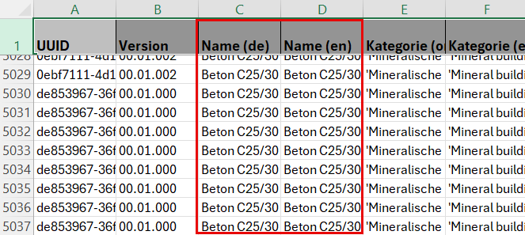
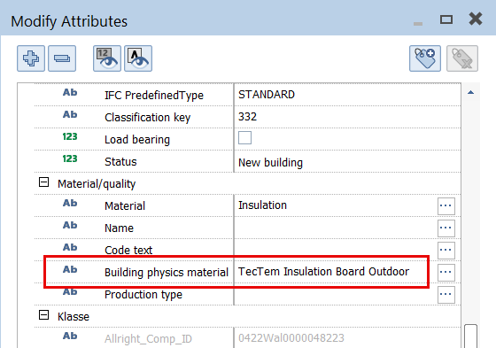
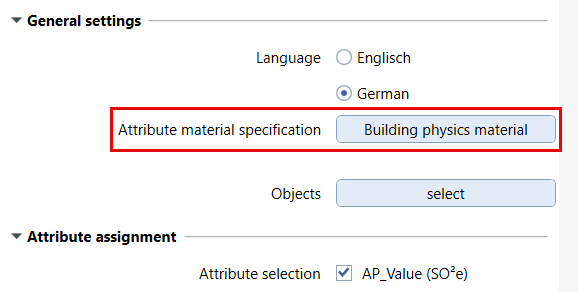
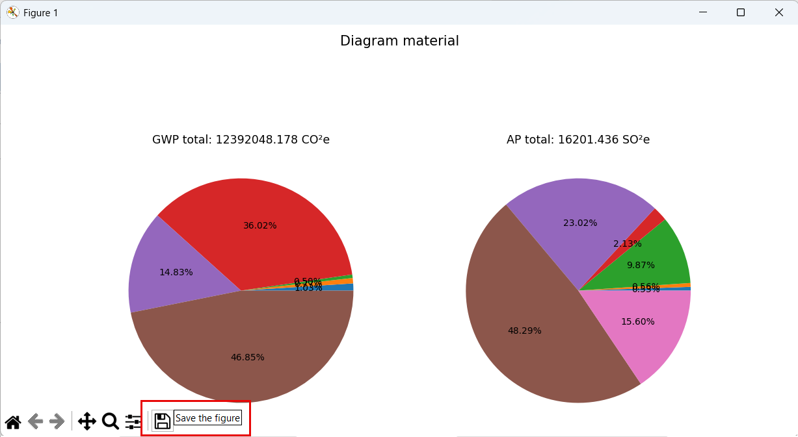

# EcoBalance

The PythonPart offers different functions to evaluate the eco balance, mainly GWP_ and AP_value, of components and models in ALLPLAN:
- **assign** eco related attributes
- **create** corresponding **data sheets**
- **show** overview **diagrams** of the eco impact

As in almost all LCA calculation, basis is the object material, for which individual eco values have been published. They are collocated in the **OEKOBAUDAT** database which is also delivered with the PythonPart as an **Excel file** **Ecobaudat_Database.xlsx**.

> ⚠️IMPORTANT\
The status and content of the Excel file might have been changed slightly since the release of the PythonPart. Whereas the content can be updated or enlarged, the existing structure of the file has to be kept **unchanged**. Otherwise the PythonPart might no longer work accurate.

## Installation

The PythonPart **EcoBalance** can be installed directly from the PluginManager in ALLPLAN. 

Alternatively, the corresponding ***.allep** package can be downloaded from the [release page](https://github.com/AnkeNiedermaier/eco-balance-public/releases). ***.allep** files are ALLPLAN internal setups that can be installed via drag and drop into the program window.

At least the version 2026 is needed to install the PythonPart.

## Installed PythonPart Scripts

If the installation was successfull, the PythonPart **EcoBalance** as well as the **Ecobaudat_Database.xlsx** file can be found
in the ALLPLAN Library:
`Office` → `Library` → `ALLPLAN GmbH` → `EcoBalance`

Besides the library, the PythonPart can also be found in the ActionBar in a newly created task area **EcoBalance** inside the task **Plug-ins**.

Whereas the location of all other files has to be kept, the **Excel table** can arbitrary be copied or moved into another folder and even be renamed afterwards.

## Preparation

To use the different functions of the PythonPart, all objects that should be considered need **appropriate material information**. Therfor the first step is to pick up the relevant material name from the **Excel file** and add it as value to the choosen **material key** attribute.

Available materials are listed in the **Name (de)** or **Name (en)** columns of the table. Which ALLPLAN attribute is used as **material key** is free of choice, but always using the same is highly recommended. Otherwise the objects can not be evaluated togehter.

## Workflow

In general, all installed PythonParts can be found in the Library palette, no matter if an additional ActionBar entry is created or not. They are started either with a **double-click** on the icon or per **Drag and Drop** into the viewport. This shows the corresponding Properties palette and executes the underlying skripts.

> 💡HINT\
The idividual functions of the PythonPart can be used independend. So it is **not** necessary to assign GWP_ or AP_ attributes to show a diagram or create a data sheet. All relevant material parameters are always looked up in the Excel file.

The palette is divided into a general part on the top which is relevant for all and individual sections for each function. Therefor the first step is always to select the **file** and **sheet** of the **Ecobaudat_Database.xlsx**.

Besides the material as such, the GWP_ and AP_value also depends on the **Modus** that should be taken into account for calculation and evaluation. It is defined in the Pulldown of the same name.

> ⚠️IMPORTANT\
As the Excel file is very large, it can take some time to load the list of available modi.

Depending on the material name column (de/en) used, the appropriate **language** as well as the **ALLPLAN attribute** in which the value has been entered are defined in the **General settings** section.

The objects to be considered are choosen afterwards in clicking on the **select** button. All common ALLPLAN options like filtering or area input are available for the selection. After the selection, the PythonParts provides different further options, but no matter which one should be used, all of the previous described steps are **mandatory** to go on.

### Assign attributes

The selected objects can be provided with the relevant **eco parameters** of their material. Which attributes should be assigned can be selected with the CheckBoxes and in clicking the **assign** button the assignment is finaly taken out.

### Evaluate objects

The elevation of the selected objects ecological impact is carried out either as **Excel data sheets** or **diagrams**. In addition there is a choice between
- **overview** of all **relevant parameters** including object name, object weight and IfcID
- GWP_ and AP_values sorted by **object type**
- GWP_ and AP_values sorted by **material**

In clicking the appropriate button, the **diagram** is shown in a separate window. From there it can also be saved as image file.

For the **data sheets** there is the option to use already existing or create new Excel files in setting file location and folder name. In clicking the **create** button the data is finaly written to the choosen file. 

> ⚠️IMPORTANT\
As the **Ecobaudat_Database.xlsx** file is very large, it can take a while to create the diagram or calculate and write the data sheet.

